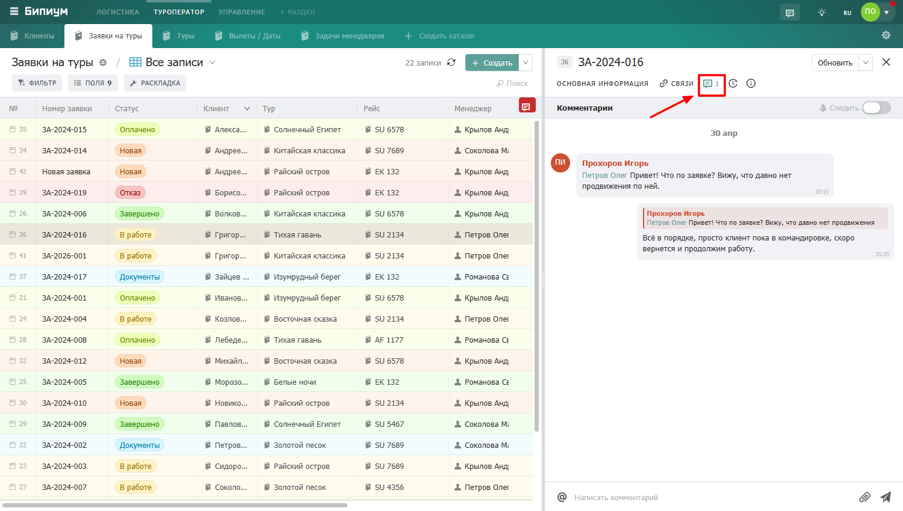

# Чат

<figure><figcaption>
Вкладка чат — переписка сотрудников
</figcaption></figure>

### Интерфейс чата

1. **История сообщений** — лента переписки, новые сообщения снизу
2. **Поле ввода** — место для набора сообщения
3. **Иконка @** — упомянуть конкретного сотрудника
4. **Скрепка** — прикрепить файл к сообщению
5. **Кнопка отправки** — отправить сообщение
6. **Следить** — подписаться на уведомления о новых сообщениях в этом чате

<figure><figcaption>
Интерфейс чата с пронумерованными элементами
</figcaption></figure>

### Отправить сообщение

Напишите текст в поле ввода и нажмите кнопку отправки или клавишу Enter. Сообщение появится в ленте с вашим именем и временем отправки.

### Упомянуть сотрудника (@)

Чтобы уведомление о сообщении пришло конкретному сотруднику — упомяните его. Нажмите иконку «@» или введите «@» прямо в тексте — появится список сотрудников. Выберите нужного и допишите сообщение. Упомянутый сотрудник получит уведомление даже если не подписан на чат этой записи.

<figure><figcaption>
Ввод @ — появляется список сотрудников для выбора
</figcaption></figure>

### Прикрепить файл

Нажмите иконку скрепки и выберите файл на компьютере — он прикрепится к сообщению. Файл можно открыть или скачать прямо из чата.

<figure><figcaption>
Сообщение с прикреплённым файлом в чате
</figcaption></figure>

### Подписаться на уведомления

По умолчанию уведомления о новых сообщениях в чате конкретной записи отключены. Чтобы получать уведомления — нажмите кнопку «Следить» в верхней части чата. Переключатель станет активным — теперь вы будете получать уведомления о каждом новом сообщении в этом чате.

Чтобы отписаться — нажмите «Следить» ещё раз.

