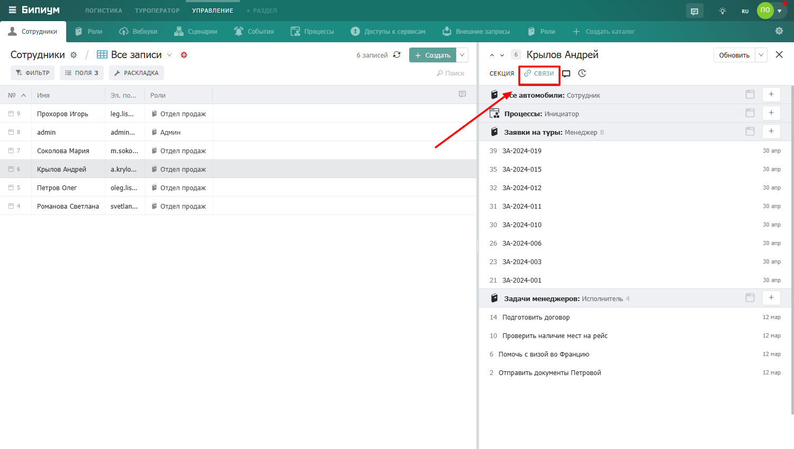

# Связи

Вкладка «Связи» показывает записи из других каталогов, которые связаны с текущей записью. Это обратная сторона связей — вы видите не те записи, которые выбраны в полях анкеты, а те записи в других каталогах, которые ссылаются на эту запись.

<figure><figcaption>
Открытая вкладка «Связи» в карточке записи
</figcaption></figure>

### Как устроена вкладка&#x20;

Связанные записи сгруппированы по каталогам. Для каждого каталога показан список связанных записей с номером и датой создания. Записи отсортированы по дате создания — новые сверху.

* **Название каталога** — заголовок группы
* **Номер записи** — порядковый номер в каталоге
* **Название записи** — кликните чтобы открыть карточку
* **Дата создания** — когда была создана связанная запись
* **Иконка «+»** — создать новую связанную запись прямо из этой вкладки

### Открытие связанной записи

Нажмите на запись — она откроется в отдельной карточке поверх текущей. Дерево записей покажет что вы открыли запись из связи.

<figure><figcaption>
Нажатие на запись — открывается карточка связанной записи
</figcaption></figure>

### Создание связанной записи

Нажмите на иконку «+» рядом с нужным каталогом — откроется форма создания новой записи. После заполнения и сохранения новая запись появится во вкладке «Связи» и автоматически будет связана с текущей записью.

<figure><figcaption>
Кнопка создания новой связанной записи
</figcaption></figure>

<figure><figcaption>
Форма создания новой связанной записи
</figcaption></figure>

<figure><figcaption>
Новая запись появилась в списке связей
</figcaption></figure>

