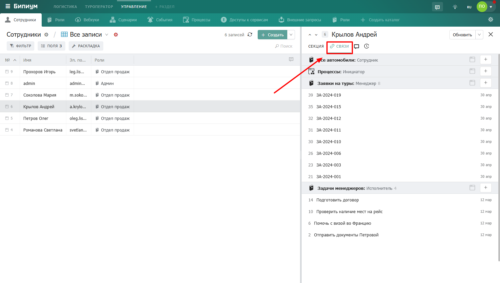

Вкладка «Связи» показывает записи из других каталогов, которые связаны с текущей записью. Это обратная сторона связей -- вы видите не те записи, которые выбраны в полях анкеты, а те записи в других каталогах, которые ссылаются на эту запись.

### Как устроена вкладка

Связанные записи сгруппированы по каталогам. Для каждого каталога показан список связанных записей с номером и датой создания. Записи отсортированы по дате создания -- новые сверху.

-  **Название каталога** -- заголовок группы

-  **Номер записи** -- порядковый номер в каталоге

-  **Название записи** -- кликните чтобы открыть карточку

-  **Дата создания** -- когда была создана связанная запись

-  **Иконка «+»** -- создать новую связанную запись прямо из этой вкладки

### Открытие связанной записи

Нажмите на запись -- она откроется в отдельной карточке поверх текущей. Дерево записей покажет что вы открыли запись из связи.

### Создание связанной записи

Нажмите на иконку «+» рядом с нужным каталогом -- откроется форма создания новой записи. После заполнения и сохранения новая запись появится во вкладке «Связи» и автоматически будет связана с текущей записью.

