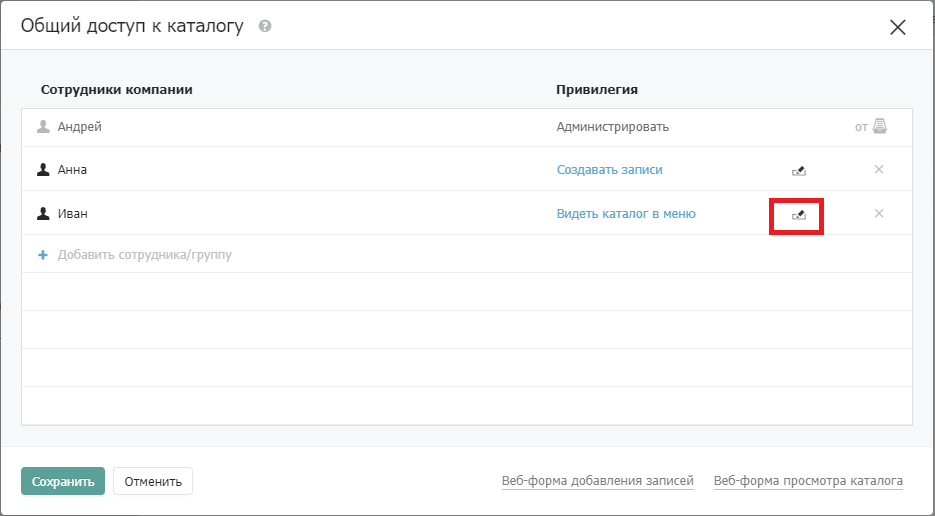
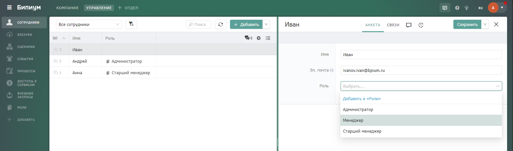

# Настраиваем правовую политику

Теперь, когда у нас уже есть небольшая система, нам необходимо разграничить доступ к данным системы между сотрудниками. Права в Бипиум можно задать как для отдельных сотрудников в системе, так и по объединяющим сотрудников сущностям: роль, отдел, регион и т.д. Рассмотрим оба варианта ниже:&#x20;

## Как настроить права доступа по сотрудникам в системе

Добавим в нашу систему несколько сотрудников, например: Ивана, Андрея и Анну. Для этого переходим в каталог "Сотрудники" и добавляем новые записи, указав имя сотрудника и адрес электронной почты.

<figure><figcaption></figcaption></figure>

### Правила на уровне Отдела и Каталога

Для начала рассмотрим простые правила на примере каталога Клиенты: \
&#x20;   Андрей - администратор системы с полным доступом ко всем данным\
&#x20;   Анна - может создавать новых Клиентов, просматривать и изменять существующих\
&#x20;   Иван - может только просматривать Клиентов, без возможности создания новых и без возможности изменять данные в существующих клиентах.

В первую очередь мы должны настроить права доступа к самому верхнему уровню - Отделу.

<figure><figcaption></figcaption></figure>

1. Переходим в нужный отдел (Компания)
2. В левом нижнем углу нажимаем "Свойства отдела"
3. Нажимаем кнопку "Доступ к отделу"

Откроется окно с правами по умолчанию: Все сотрудники - Администрировать

<figure><figcaption></figcaption></figure>

Нажимая кнопку "Добавить сотрудника/группу" добавляем правила для наших сотрудников:\
\- Андрей - "Администрировать"\
\- Иван и Анна - "Видеть каталог в меню"\
\- Правило по умолчанию для всех сотрудников удаляем. \
После этого нажимаем кнопку "Сохранить".

<figure><figcaption></figcaption></figure>

Теперь необходимо настроить права на Каталог.

<figure><figcaption></figcaption></figure>

1. Переходим в нужный каталог (Клиенты)
2. Нажимаем иконку шестеренки рядом с названием каталога
3. Нажимаем кнопку "Доступ к каталогу"

Откроется окно с правами доступа с правилами, унаследованными от отдела.

<figure><figcaption></figcaption></figure>

Тут мы уже задаем правила для остальных сотрудников:\
&#x20;   Анне - привилегию "Создавать записи"\
&#x20;   Ивану - привилегию "Видеть все записи"\
Сохраняем заданные правила.

<figure><figcaption></figcaption></figure>

На скриншотах ниже примеры того, что видит каждый сотрудник под своей учетной записью:

Андрей - с привилегией "Администратор" может видеть, изменять, добавлять и удалять записи. Также может настраивать поля в каталоге (менять структуру) и назначать права доступа.

<figure><figcaption></figcaption></figure>

<figure><figcaption></figcaption></figure>

Анна - с привилегией "Создавать записи" может видеть, изменять и добавлять записи. Возможности удалять записи, а также настраивать поля в каталоге и назначать права у неё нет.

<figure><figcaption></figcaption></figure>

<figure><figcaption>
Кнопка "Доступ к каталогу" отображается, но лишь покажет текущие права, редактировать их возможности не будет
</figcaption></figure>

Иван - с привилегией "Видеть все записи" может только видеть записи. Редактировать, добавлять и удалять записи он не может.

<figure><figcaption></figcaption></figure>

### Правила на уровне правовых видов

Немного усложним предыдущую схему и рассмотрим на примере каталога Заказы: \
&#x20;   Андрей - также администратор системы с полным доступом ко всем данным\
&#x20;   Анна - также может создавать новые Заказы, просматривать и изменять существующие\
&#x20;   Иван - может просматривать и изменять Заказы, но не все, а только те, где он назначен ответственным менеджером. Также ему будет запрещено менять поля "Клиент" и "Ответственный менеджер" в заказах - данные поля он сможет только видеть, а дополнительное поле "Внутренний комментарий" и вовсе не должен видеть.

Добавим в каталоге "Заказы" новые поля типов "Сотрудник" и "Многострочный текст" для указания ответственного менеджера и внутреннего комментария соответственно:

<figure><figcaption></figcaption></figure>

Права для Отдела были настроены ранее, их менять нам не требуется. Настроим права для Каталога: Для Анны привилегия будет такая же: "Создавать записи"\
Для Ивана мы выдадим привилегию: "Видеть каталог в меню". Дополнительно скроем от него поле: "Внутренний комментарий"

<figure><figcaption></figcaption></figure>

<figure><figcaption></figcaption></figure>

<figure><figcaption></figcaption></figure>

Текущие настройки пока позволяют Ивану лишь видеть каталог в меню, при этом ни одна запись в каталоге ему пока не доступна даже для просмотра. Теперь нам необходимо разрешить ему изменять те записи, где он является ответственным менеджером. Для этого создаем правовой вид со следующим фильтром:

<figure><figcaption></figcaption></figure>

Сохраняем вид в качестве правового, название произвольное:

<figure><figcaption></figcaption></figure>

Теперь для данного вида назначаем следующие права: добавляем Ивана - привилегия "Изменять записи", Право редактировать поля: Клиент - видеть, Ответственный менеджер - видеть, в других полях всё оставляем по умолчанию.&#x20;

<figure><figcaption></figcaption></figure>

Права настроены, теперь на примерах посмотрим что видит каждый пользователь системы.\
Анна видит все записи и может редактировать все поля:

<figure><figcaption></figcaption></figure>

<figure><figcaption></figcaption></figure>

Иван видит только те записи, где он назначен ответственным менеджером, а также не может редактировать поля "Клиент" и "Ответственный менеджер", поле "Внутренний комментарий" не видит вовсе:

<figure><figcaption></figcaption></figure>

<figure><figcaption></figcaption></figure>

## Как настроить права доступа по объединяющим сущностям

Под объединяющей сущностью в данном примере мы будем рассматривать роли сотрудников. Рассмотрим 3 роли: Администратор, Старший менеджер и Менеджер. Чтобы можно было сотрудникам назначать роли, а потом еще и настраивать права под эти роли мы должны сначала создать каталог "Роли" с одним полем "Наименование роли":

<figure><figcaption></figcaption></figure>

Затем создать записи с нашими ролями:

<figure><figcaption></figcaption></figure>

Теперь нужно привязать данную сущность к каталогу сотрудников. Добавляем поле типа "Связанный каталог" и указываем связь на каталог Роли

<figure><figcaption></figcaption></figure>

Распределяем созданные роли нашим сотрудникам: Андрей - администратор, Анна - старший менеджер, Иван - менеджер

<figure><figcaption></figcaption></figure>

Теперь распределяем права: мы можем использовать те же правила, что и в схеме с правами под конкретных сотрудников, описанные выше, но теперь уже распределить по ролям.\
Для отдела:

<figure><figcaption></figcaption></figure>

Для каталога Клиенты:

<figure><figcaption></figcaption></figure>

Для каталога Заказы:

<figure><figcaption></figcaption></figure>

Для правового вида:

<figure><figcaption></figcaption></figure>

Все сотрудники увидят в системе то же самое, что и в схеме выше. Но теперь, добавляя в систему нового сотрудника, нам достаточно просто задать ему роль и права автоматически будут применены - дополнительно заходить и настраивать права для конкретного сотрудника не требуется.

Для примера добавим в систему нового сотрудника с ролью "Менеджер", создадим пару заказов, где назначим его ответственным

<figure><figcaption>
Добавили нового сотрудника с ролью Менеджер
</figcaption></figure>

<figure><figcaption>
Создали два новых заказа и назначили в них ответственным нового сотрудника
</figcaption></figure>

Новый сотрудник (Пётр) в каталоге Клиенты увидит всех клиентов, но редактировать их не сможет. В каталоге Заказы увидит только 2 своих заказа, поле "Внутренний комментарий" от него скрыт, поля "Клиент" и "Ответственный менеджер" редактировать он не сможет.

<figure><figcaption>
Каталог Клиенты. Все записи видны, но редактирование недоступно
</figcaption></figure>

<figure><figcaption>
Каталог Заказы. Видны только определенные заказы, для редактирования доступны не все поля
</figcaption></figure>
