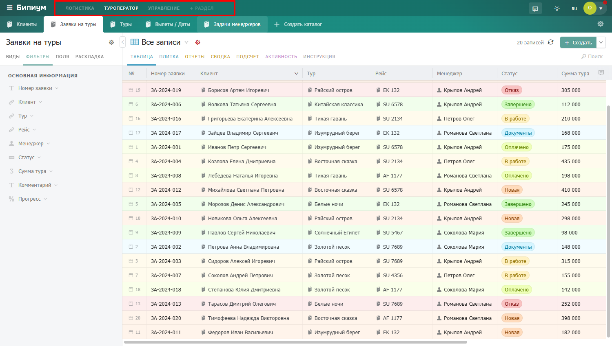
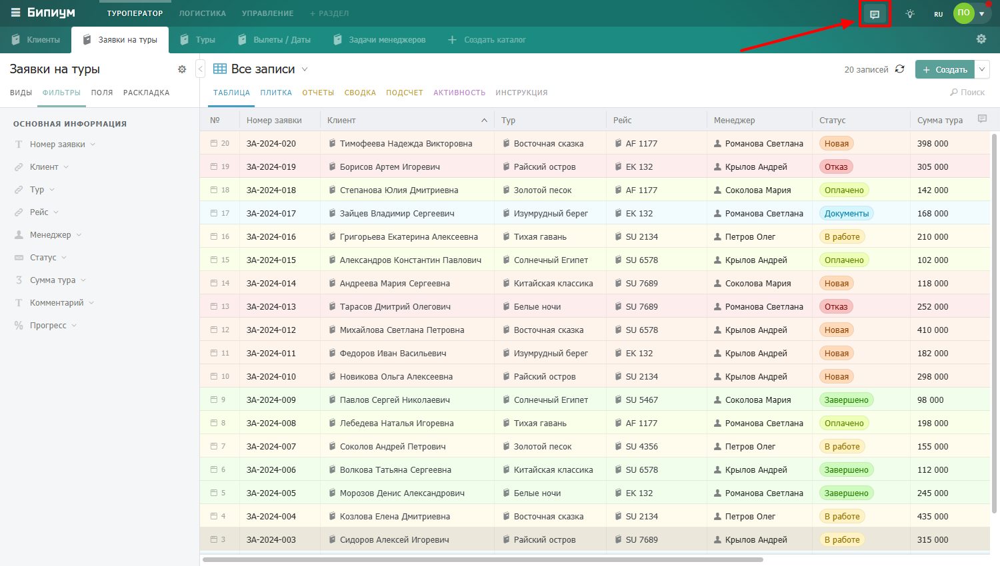
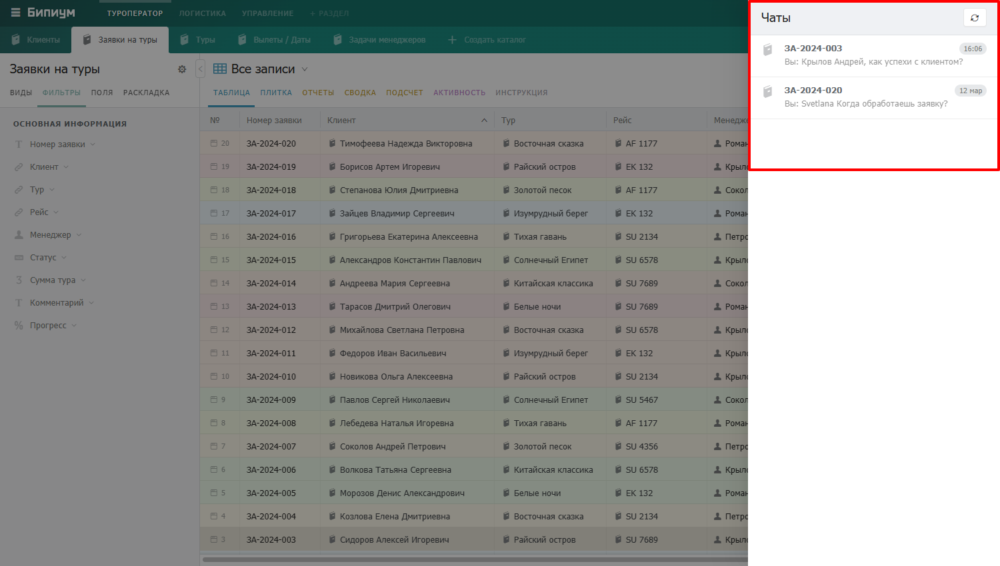
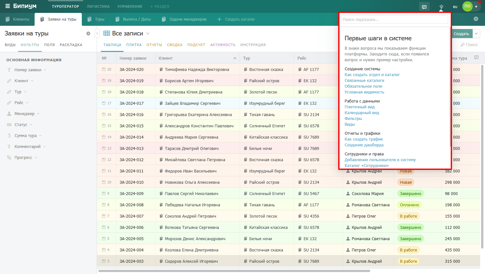
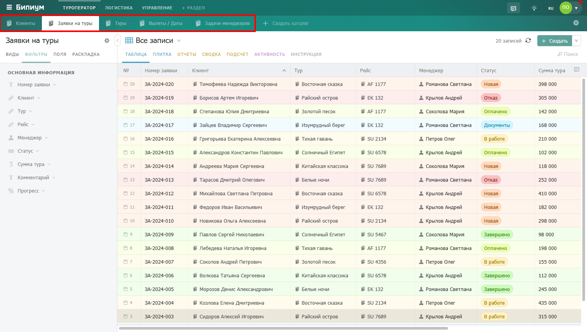

# Интерфейс системы

## Структура интерфейса

<table><thead><tr><th width="227">Зона/номер на скриншоте</th><th>Что содержит</th></tr></thead><tbody><tr><td><strong>Верхняя панель / 1</strong></td><td>Логотип, меню разделов, иконка чата, подсказки по работе.</td></tr><tr><td><strong>Меню каталогов / 2</strong></td><td>Каталоги открытого раздела и кнопка создания каталога.</td></tr><tr><td><strong>Левая панель / 3</strong></td><td>Виды, фильтры, поля и раскладка для текущего каталога.</td></tr><tr><td><strong>Рабочая область / 4</strong></td><td>Записи каталога в выбранном режиме отображения.</td></tr><tr><td><strong>Меню системных настроек / 5</strong></td><td>Системные настройки: смена языка, смена фона и т.п.</td></tr></tbody></table>

<figure><figcaption>
Общий интерфейс системы
</figcaption></figure>

## Верхняя панель

Расположена в самом верху экрана и видна всегда, в каком бы каталоге вы ни находились.

### **Логотип Бипиум**

Нажав на логотип, вам откроется дополнительное меню с разделами и каталогами. В котором вы можете быстро найти необходимый вам каталог или добавить новый раздел.

<figure><figcaption>
Логотип Бипиум.
</figcaption></figure>

<figure><figcaption>
Дополнительное меню разделов и каталогов.
</figcaption></figure>

### Меню разделов

Разделы — это способ организации каталогов по темам или подразделениям компании. Например, «Логистика», «Туроператор», «Управление». Каждый раздел содержит набор своих каталогов. Нажмите на название раздела в верхней панели — ниже откроются его каталоги.

<figure><figcaption></figcaption></figure>


Вы видите только те разделы, к которым у вас есть доступ. Если нужного раздела нет — обратитесь к администратору системы.


### Панель чатов

Нажмите на иконку чата в верхней панели — откроется список записей с активными чатами. Записи отсортированы по времени последнего сообщения — самые свежие сверху. Нажмите на запись чтобы сразу открыть её карточку с чатом.

<figure><figcaption>
Иконка чата в интерфейсе
</figcaption></figure>

<figure><figcaption>
Открытая панель чатов — список записей с последними сообщениями
</figcaption></figure>

### Иконка подсказки

Нажмите на иконку подсказки — откроется поисковое окно с подсказками по работе в Бипиум.

<figure><figcaption>
Иконка подсказки в интерфейсе
</figcaption></figure>

<figure><figcaption>
Поисковое окно подсказок по работе в Бипиум
</figcaption></figure>

## Строка каталогов

Находится под верхней панелью. Показывает все каталоги выбранного раздела в виде вкладок.

### **Вкладки каталогов**

Информация в Бипиуме структурирована. Записи с одинаковой структурой хранятся в каталогах. Например, каталоги клиентов, товаров, обращений, сделок, задач или проектов. В Бипиуме может быть неограниченное количество каталогов и записей в каждом из них. \
\
Нажмите на вкладку чтобы открыть нужный каталог. Активная вкладка выделяется белым цветом.

<figure><figcaption>
Вкладки каталогов
</figcaption></figure>

### **Создать каталог**

Кнопка для добавления нового каталога в раздел. Видна только администраторам.

<figure><figcaption>
Кнопка «+Создать каталог»
</figcaption></figure>

## Левая панель

Расположена слева от рабочей области. Содержит инструменты для управления отображением записей в текущем каталоге.

Панель переключается между четырьмя режимами:

### Виды

Переключение между сохранёнными видами каталога. Каждый вид — это сохранённый набор фильтров, сортировок и отображаемых полей.

<figure><figcaption></figcaption></figure>

### **Фильтры**

Список всех полей каталога с возможностью задать условия фильтрации. Активные фильтры подсвечиваются.

<figure><figcaption></figcaption></figure>

### **Поля**

Управление отображаемыми столбцами и их порядком.

<figure><figcaption></figcaption></figure>

### **Раскладка**

Настройка параметров режима Плитка — группировка, сортировка карточек, цветовая подсветка.

<figure><figcaption></figcaption></figure>

## Рабочая область

Основная часть экрана — здесь отображаются записи каталога. В верхней части рабочей области находится строка управления каталогом. 

<figure><figcaption>
Рабочая область — строка управления сверху и записи ниже
</figcaption></figure>

### Строка управления каталогом

<table><thead><tr><th width="227">Зона / номер на скриншоте</th><th>Что это</th></tr></thead><tbody><tr><td><strong>Название каталога / 1</strong></td><td>Названия текущего каталога.</td></tr><tr><td><strong>Иконка шестерёнки / 2</strong></td><td>Настройки и права доступа к каталогу.</td></tr><tr><td><strong>Переключатель вида / 3</strong></td><td>Название текущего вида и кнопка выбора другого.</td></tr><tr><td><strong>Режимы отображения / 4</strong></td><td>Варианты режимов отображения записей каталога.</td></tr><tr><td><strong>Счётчик записей / 5</strong></td><td>Количество записей с учётом активных фильтров.</td></tr><tr><td><strong>Обновить /</strong> <strong>6</strong></td><td>Кнопка для обновления списка записей.</td></tr><tr><td><strong>+ Создать /</strong> <strong>7</strong></td><td>Кнопка для добавления новой записи.</td></tr><tr><td><strong>Поиск /</strong> 8</td><td>Быстрый поиск по текстовым полям.</td></tr></tbody></table>

<figure><figcaption>
Строка управления с обозначенными элементами
</figcaption></figure>

### Режимы отображения

Записи каталога можно просматривать в разных режимах — переключайтесь между ними в зависимости от задачи:

<table><thead><tr><th width="164">Режим</th><th>Для чего</th></tr></thead><tbody><tr><td><strong>Таблица</strong></td><td>Список записей в виде таблицы — основной режим работы</td></tr><tr><td><strong>Плитка</strong></td><td>Аналог kanban-доски для управления задачами по статусам</td></tr><tr><td><strong>Отчёты</strong></td><td>Графики и дашборды — анализ данных</td></tr><tr><td><strong>Сводка</strong></td><td>Сводная таблица с группировкой и подсчётами</td></tr><tr><td><strong>Подсчёт</strong></td><td>Быстрый личный анализ показателей</td></tr><tr><td><strong>Активность</strong></td><td>Лента изменений — кто и что менял в каталоге</td></tr><tr><td><strong>Инструкция</strong></td><td>Правила работы с каталогом от администратора</td></tr></tbody></table>

## Системные настройки

Нажмите на иконку настроек в правом верхнем углу — откроется меню с дополнительными возможностями:

* **Выбор языка —** выбор языка в системе: русский или английский
* **Имя и почта пользователя** — имя и электронная почта текущего пользователя системы Бипиум.
* **Фон для вас** — смена цвета фона интерфейса.
* **Документация** — ссылка на официальную документацию Бипиума.
* **Задать вопрос** — написать в техническую поддержку.
* **Выйти —** кнопка выхода из учётной записи.

\[Скриншот: открытое меню системных настроек]

