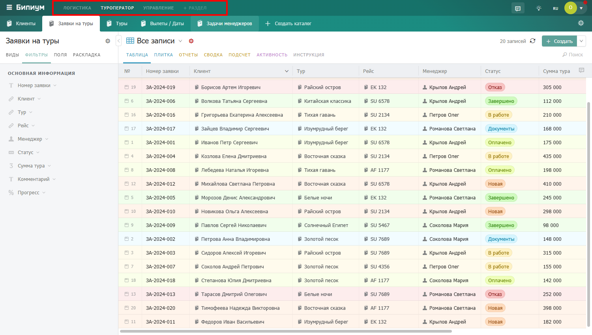
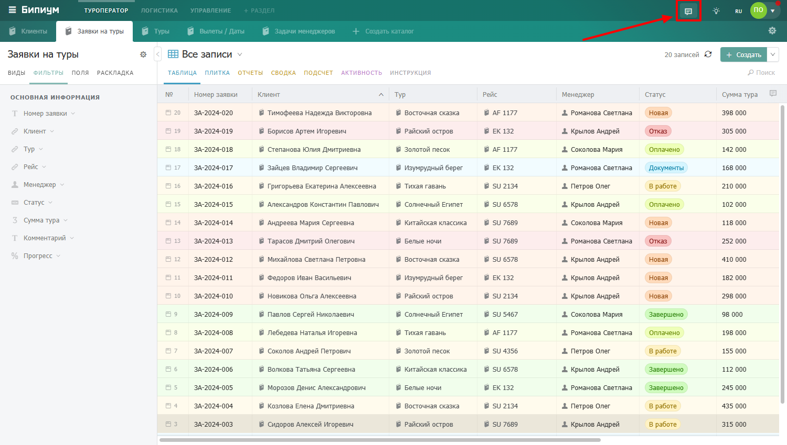
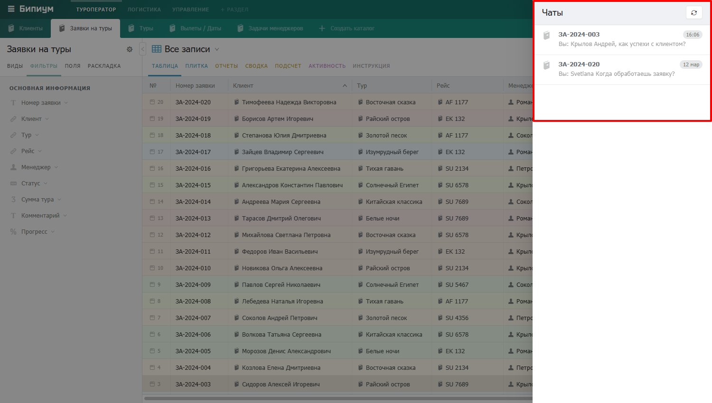
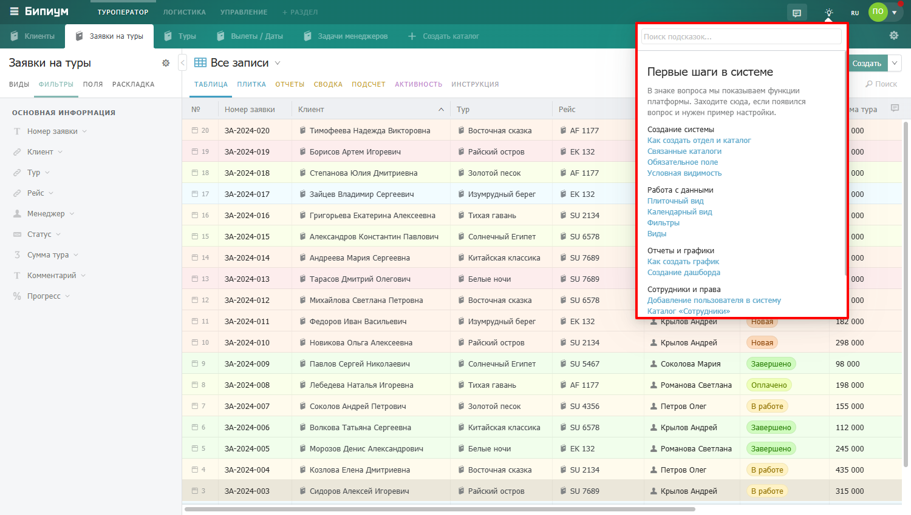
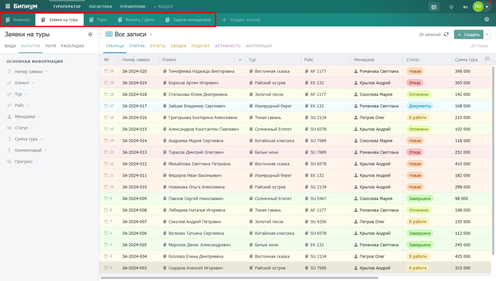

Бипиум -- браузерное приложение. Всё что нужно для работы -- это браузер и доступ в интернет. Интерфейс состоит из нескольких постоянных зон и рабочей области в центре.

## Структура интерфейса



---

*  

   **Зона/номер на скриншоте**

*  

   **Что содержит**

---

*  

   [**Верхняя панель**](./sections#верхняя-панель) **/ 1**

*  

   Логотип, меню разделов, иконка чата, подсказки по работе.

---

*  

   [**Меню каталогов**](./sections#меню-каталогов) **/ 2**

*  

   Каталоги открытого раздела и кнопка создания каталога.

---

*  

   [**Левая панель**](./sections#левая-панель) **/ 3**

*  

   Виды, фильтры, поля и раскладка для текущего каталога.

---

*  

   [**Рабочая область**](./sections#рабочая-область) **/ 4**

*  

   Записи каталога в выбранном режиме отображения.

---

*  

   [**Меню пользователя**](./sections#меню-пользователя) **/ 5**

*  

   Смена языка, имя, почта, настройки фона и т.п.



## Верхняя панель

Расположена в самом верху экрана и видна всегда, в каком бы каталоге вы ни находились.

### **Логотип Бипиум**

Нажав на логотип, вам откроется дополнительное меню с разделами и каталогами. В котором вы можете быстро найти необходимый вам каталог или добавить новый раздел.

### Меню разделов

Разделы -- это способ организации каталогов по темам или подразделениям компании. Например, «Логистика», «Туроператор», «Управление». Каждый раздел содержит набор своих каталогов. Нажмите на название раздела в верхней панели -- ниже откроются его каталоги.

{width=1500px height=850px}

:::info 

Вы видите только те разделы, к которым у вас есть доступ. Если нужного раздела нет -- обратитесь к администратору системы.

:::

### Панель чатов

Нажмите на иконку чата в верхней панели -- откроется список записей с активными чатами. Записи отсортированы по времени последнего сообщения -- самые свежие сверху. Нажмите на запись чтобы сразу открыть её карточку с чатом.

### Иконка подсказки

Нажмите на иконку подсказки -- откроется поисковое окно с подсказками по работе в Бипиум.

.png> "Иконка подсказки в интерфейсе"){width=1500px height=850px}

## Меню каталогов

Находится под верхней панелью. Показывает все каталоги выбранного раздела в виде вкладок.

### **Вкладки каталогов**

Информация в Бипиуме структурирована. Записи с одинаковой структурой хранятся в каталогах. Например, каталоги клиентов, товаров, обращений, сделок, задач или проектов. В Бипиуме может быть неограниченное количество каталогов и записей в каждом из них. \
\
Нажмите на вкладку чтобы открыть нужный каталог. Активная вкладка выделяется белым цветом.

### **Создать каталог**

Кнопка для добавления нового каталога в раздел. Видна только администраторам.

## Левая панель

Расположена слева от рабочей области. Содержит инструменты для управления отображением записей в текущем каталоге.

Панель переключается между четырьмя режимами:

### Виды

Переключение между сохранёнными видами каталога. Каждый вид -- это сохранённый набор фильтров, сортировок и отображаемых полей.

.png> "Вкладка Виды"){width=1500px height=850px}

### **Фильтры**

Список всех полей каталога с возможностью задать условия фильтрации. Активные фильтры подсвечиваются.

.png> "Вкладка Фильтры"){width=1500px height=850px}

### **Поля**

Управление отображаемыми столбцами и их порядком.

.png> "Вкладка Поля"){width=1500px height=850px}

### **Раскладка**

Настройка параметров режимов «Таблица» и «Плитка» -- группировка, сортировка карточек, цветовая подсветка.

.png> "Вкладка Раскладка"){width=1500px height=850px}

## Рабочая область

Основная часть экрана -- здесь отображаются записи каталога. В верхней части рабочей области находится строка управления каталогом.

### Строка управления каталогом

| Зона / номер на скриншоте  | Что это                                        |
|----------------------------|------------------------------------------------|
| **Название каталога / 1**  | Названия текущего каталога                     |
| **Иконка шестерёнки / 2**  | Настройки и права доступа к каталогу           |
| **Переключатель вида / 3** | Название текущего вида и кнопка выбора другого |
| **Режимы отображения / 4** | Варианты режимов отображения записей каталога  |
| **Счётчик записей / 5**    | Количество записей с учётом активных фильтров  |
| **Обновить / 6**           | Кнопка для обновления списка записей           |
| **\+ Создать / 7**         | Кнопка для добавления новой записи             |
| **Поиск / 8**              | Быстрый поиск по текстовым полям               |

### Режимы отображения

Записи каталога можно просматривать в разных режимах -- переключайтесь между ними в зависимости от задачи:



---

*  

   Режим

*  

   Для чего

---

*  

   **Таблица**

*  

   Список записей в виде таблицы -- основной режим работы

---

*  

   **Плитка**

*  

   Аналог kanban-доски для управления задачами по статусам

---

*  

   **Отчёты**

*  

   Графики и дашборды -- анализ данных

---

*  

   **Сводка**

*  

   Сводная таблица с группировкой и подсчётами

---

*  

   **Подсчёт**

*  

   Быстрый личный анализ показателей

---

*  

   **Активность**

*  

   Лента изменений -- кто и что менял в каталоге

---

*  

   **Инструкция**

*  

   Правила работы с каталогом от администратора



## Меню пользователя

**Меню пользователя** находится в правом верхнем углу интерфейса. При нажатии на аватар или имя текущего пользователя открывается панель со следующими элементами:



---

*  

   Элемент

*  

   Назначение

---

*  

   Имя и почта

*  

   Отображение данных авторизованного пользователя

---

*  

   «Фон для вас»

*  

   Настройка цветовой темы интерфейса

---

*  

   Лицензия

*  

   Информация по лицензии

---

*  

   «Документация»

*  

   Переход к официальной документации

---

*  

   «Задать вопрос»

*  

   Отправка запроса в техподдержку

---

*  

   «Выйти»

*  

   Завершение сессии



.png> "Меню пользователя"){width=1500px height=850px}

**Переключатель языка** (русский / английский) вынесен отдельно и находится рядом с меню пользователя.

