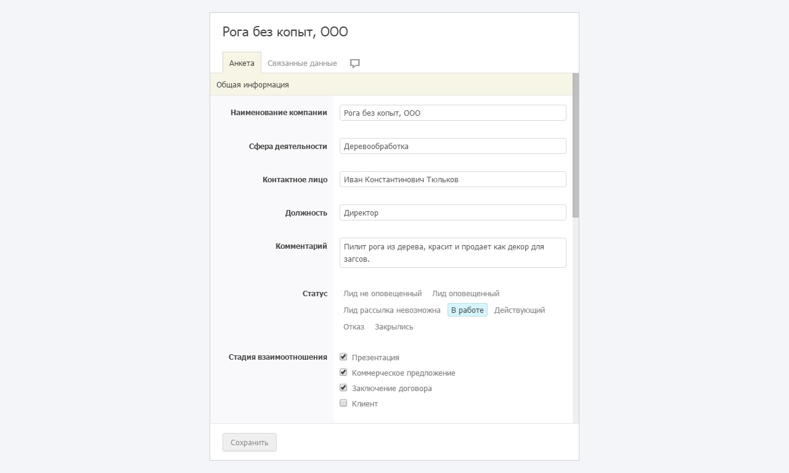
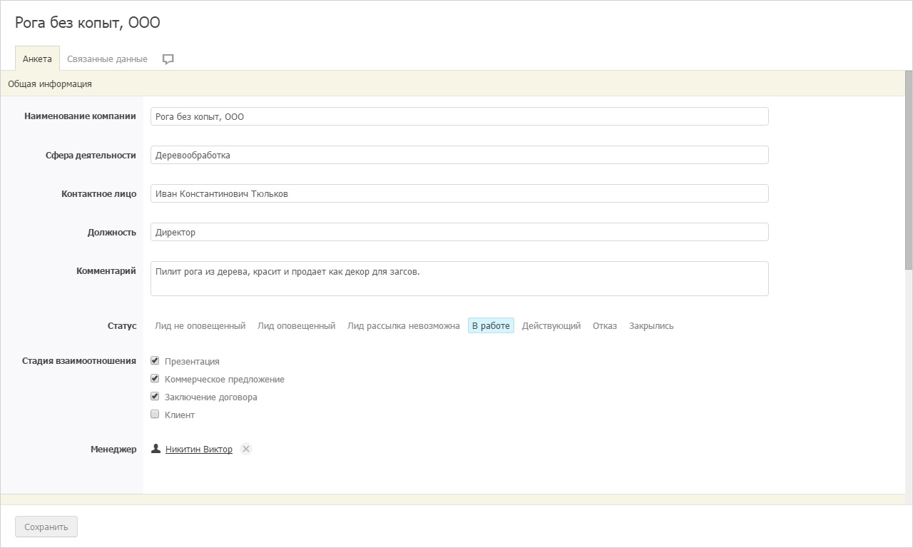

# Веб-формы

Бипиум позволяет открывать карточку записи и создания новой записи в сторонних приложениях и сайтах. При этом открывается не весь интерфейс Бипиум, а только анкета записи — веб-форма.

## Доступ к веб-формам

Бипиум принимает запросы только от авторизованных пользователей и перед отображением веб-формы проверяет права на доступ к данным. Об автоматической авторизации рассказано ниже.

Ссылку на веб-форму можно скопировать в окне доступа к каталогу или записи.

## Типы веб-форм

### Создание новой записи

Форма для создания новой записи в каталоге. Страница откроется, если у сотрудника есть право на создание записей в каталоге.

Адрес страницы:\
`http://ВАШДОМЕН.bpium.ru/?action=record-new&catalog=КАТАЛОГ`

Параметры:

* _ВАШДОМЕН_ — адрес вашего Бипиума
* _КАТАЛОГ_ — номер (идентификатор) каталога

Пример:\
`http://test.bpium.ru/?action=record-new&catalog=7`

### Редактирование существующей записи

Форма для просмотра и изменения определённой записи в каталоге. Страница откроется, если у сотрудника есть право видеть эту запись или более высокая привилегия. Если у сотрудника есть право изменять запись — он сможет изменять данные записи.

Адрес страницы:\
`http://ВАШДОМЕН.bpium.ru/?action=record-open&catalog=КАТАЛОГ&record=ЗАПИСЬ`

Параметры:

* _ВАШДОМЕН_ — адрес вашего Бипиума
* _КАТАЛОГ_ — номер (идентификатор) каталога
* _ЗАПИСЬ_ — номер (идентификатор) записи

Пример:\
`http://test.bpium.ru/?action=record-open&catalog=7&record=12`

## Стиль формы

В Бипиуме созданы 2 вида отображения веб-формы: в окне и во весь экран.

### Форма в окне



Вид по умолчанию.

### Форма во весь экран



Чтобы показать форму во весь экран, передайте параметр `&screen=full` в конце адреса.

Пример:\
`http://test.bpium.ru/?action=record-new&catalog=7&screen=full`

## Автоматическая авторизация

Бипиум показывает веб-формы только авторизованным пользователям. Если сотрудник не авторизован, то его учётные данные можно передать автоматически — через адрес страницы (базовая авторизация через URL).

Формат:\
`http://ВАШДОМЕН.bpium.ru/?login=ЛОГИН&password=ПАРОЛЬ`

Параметры:

* _ЛОГИН_ — адрес электронной почты для входа в Бипиум
* _ПАРОЛЬ_ — пароль для входа в Бипиум
* _ВАШДОМЕН_ — адрес вашего Бипиума


~~**HTTP**~~\
Многие браузеры блокируют запросы с авторизацией через URL на протоколе HTTP. Указывайте протокол HTTPS в URL.



Вне зависимости от протокола автоматическая авторизация не работает в тегах \<iframe>.


Если открыть страницу без авторизации, Бипиум покажет окно ввода логина и пароля.

### Безопасность данных для формы создания записи

В Бипиуме привилегия «Создавать записи» включает право изменять все записи каталога. Это значит, что размещать форму на сайте без дополнительной настройки не безопасно.

Для защиты данных настройте права пользователя:\
1\. Удобнее всего для таких запросов завести отдельного сотрудника\
2\. Не давайте права этому сотруднику (и его правовым группам) на каталог и отдел\
3\. Создайте правовой вид, в который не попадёт ни одна запись каталога (с помощью невыполнимых условий фильтра). Сохраните вид и дайте право этому пользователю «создавать записи». _Таким образом, пользователь не сможет видеть записи каталога, но сможет создавать новые._

Подробнее о настройке правовой политики в статье «[Права](policy.md)».

## Пример размещения формы на сайте

Для размещения формы на сайте вставьте этот код в то место страницы, в котором вы хотите показать форму.

```
<iframe src='http://ВАШДОМЕН.bpium.ru/?action=record-open&catalog=КАТАЛОГ&screen=full&login=ЛОГИН&password=ПАРОЛЬ' width='800' height='600'>
</iframe>
```

Укажите домен, каталог и авторизационные данные. Не забудьте, что код веб-страниц открытый и любой посетитель сможет увидеть ваши авторизационные данные. Поэтому для размещения используйте данные специального пользователя и настройте его права.
